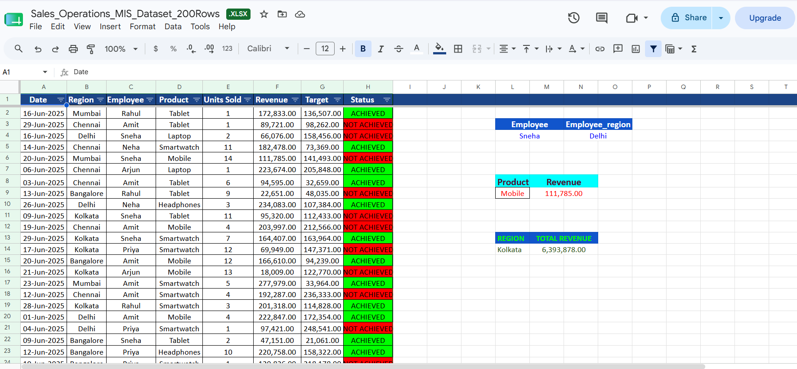
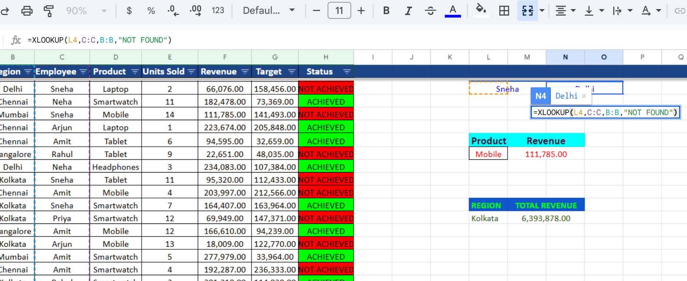

# 📊 Sales & Operations MIS Dashboard

> **Excel | Google Sheets | MIS Reporting Project**  
> Built by **Smita Basu**

---

## 🔗 Live Dashboard
👉 [Click here to view the Live Interactive Dashboard](YOUR_GOOGLE_SHEET_LINK_HERE)

> *Open the link → Go to the Dashboard sheet tab to see charts and KPIs*

---

## 📌 Project Overview

This is a complete **Sales & Operations MIS Dashboard** built in Google Sheets
analyzing **200 rows** of real-world style sales transaction data across
multiple regions, employees, and product categories.

The project simulates a real MIS Analyst workflow — from raw data cleaning
to building an interactive reporting dashboard.

---

## 📈 Key Business Metrics

| Metric | Value |
|--------|-------|
| 💰 Total Revenue | ₹30,490,230 |
| 📦 Total Units Sold | 1,591 |
| 🎯 Achievement Rate | 57.5% |
| 🏆 Top Region | Mumbai |
| 📅 Data Period | June 2025 |

---

## 🗂️ Dataset Information

### 📥 Raw Dataset (Original - 7 Columns)
| Column | Description |
|--------|-------------|
| Date | Transaction date |
| Region | City (Mumbai, Delhi, Chennai, Kolkata, Bangalore) |
| Employee | Sales rep name |
| Product | Product category sold |
| Units Sold | Number of units per transaction |
| Revenue | Revenue generated (₹) |
| Target | Sales target for that transaction |

---

## 🧹 Data Cleaning & Transformation

### 🔧 Cleaning Steps Performed

| Step | Action | Result |
|------|--------|--------|
| 1 | Checked for blank/empty cells | ✅ No blank cells found |
| 2 | Checked for duplicate rows (Data → Remove Duplicates) | ✅ No duplicates found |
| 3 | Verified date format consistency | ✅ All dates in DD-Mon-YYYY format |
| 4 | Froze header row | ✅ Headers always visible while scrolling |
| 5 | Adjusted row height & column width | ✅ Clean readable layout |
| 6 | Applied Auto Filters on all columns | ✅ Easy data filtering enabled |
| 7 | Styled header row | ✅ Bold text, blue background |

---

### 🔄 Data Transformation Steps

| Step | What was added | Method |
|------|---------------|--------|
| 1 | **Status Column** (new 8th column) | `=IF(F2>G2,"ACHIEVED","NOT ACHIEVED")` |
| 2 | **Conditional Formatting** on Status | Green = ACHIEVED, Red = NOT ACHIEVED |
| 3 | **Employee → Region Lookup** | `=XLOOKUP(L4,C:C,B:B,"NOT FOUND")` |
| 4 | **Product → Revenue Lookup** | `=VLOOKUP(L9,D:F,3,FALSE)` |
| 5 | **Region → Total Revenue** | `=SUMIF(B:B,L14,F:F)` |

---

### 📊 Before vs After

| | Raw Data | After Transformation |
|--|---------|---------------------|
| Columns | 7 | 8 (Status added) |
| Blank Cells | 0 | 0 |
| Duplicate Rows | 0 | 0 |
| Header Styling | None | Bold + Blue background |
| Filters | None | Auto filters on all columns |
| Status Tracking | None | ACHIEVED / NOT ACHIEVED |
| Lookup Tables | None | XLOOKUP, VLOOKUP, SUMIF |

### 🖼️ Cleaned Dataset Preview

---

## 🛠️ Excel / Google Sheets Skills Used

### Formulas
| Formula | Purpose |
|---------|---------|
| `IF(F2>G2,"ACHIEVED","NOT ACHIEVED")` | Status column logic |
| `VLOOKUP(L9,D:F,3,FALSE)` | Product revenue lookup |
| `XLOOKUP(L4,C:C,B:B,"NOT FOUND")` | Employee region lookup |
| `SUMIF(B:B,L14,F:F)` | Region-wise total revenue |

### Features Built
- ✅ **Conditional Formatting** — Green (ACHIEVED) / Red (NOT ACHIEVED)
- ✅ **Pivot Tables** — Region, Employee, Product, Status summaries
- ✅ **Charts** — Region-wise bar chart, Employee analysis, Product revenue, Pie chart
- ✅ **KPI Cards** — Total Revenue, Units Sold, Achievement Rate, Top Region
- ✅ **Data Filters** — Auto filters on all columns

---

## 📊 Dashboard Preview

### 🔹 KPI Overview

### 🔹 Raw Dataset

### 🔹 Cleaned Dataset

### 🔹 Formulas in Action

### 🔹 Pivot Tables Summary

### 🔹 Charts Dashboard

---

## 📂 Repository Structure

📁 Sales-Operations-MIS-Dashboard
│
├── 📄 README.md
├── 📊 raw_dataset.xlsx
└── 📁 screenshots
    ├── kpi_overview.png
    ├── raw_dataset.png
    ├── formulas.png
    ├── pivot_tables.png
    └── charts_dashboard.png 

---

## 💡 Key Insights from the Data

- **Mumbai** generated the highest revenue — ₹6,584,169
- **Laptop** was the top revenue-generating product — ₹7,314,068
- **Sneha** sold the highest units — 321 units
- **57.5%** of all transactions met their sales target
- **Amit** generated the highest total revenue among employees — ₹5,721,046

---

## 🚀 How to View This Project

1. Click the **Live Dashboard link** at the top of this README
2. Navigate to the **Dashboard tab** in Google Sheets
3. Explore **Pivot Table sheets** for detailed breakdowns
4. Check the **Raw Data sheet** to see formulas in each column

---

## 👩‍💼 About the Author

**Smita Basu**  
Aspiring Datat, Business & MIS Analyst  
Skills: Excel | Google Sheets | MIS Reporting | Data Analysis | Pivot Tables | SQL(MYSQL) | Microsoft Power BI | Python | Data Visualization | Retail Analysis | Customer-intelligence Analysis

🔗 [LinkedIn Profile](https://www.linkedin.com/in/smita-basu-343052260?utm_source=share_via&utm_content=profile&utm_medium=member_android)

---

⭐ *If you found this project helpful, please give it a star!*
